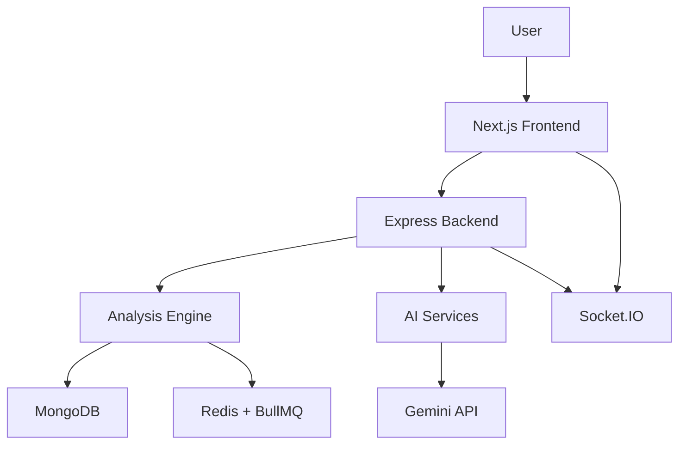

# Archon

<div align="center">

AI-powered codebase intelligence platform for analyzing, visualizing, and understanding software architecture.

[](https://nodejs.org/)
[](https://nextjs.org/)
[](https://www.mongodb.com/)
[](https://redis.io/)
[](https://aistudio.google.com/)

</div>

Archon helps engineering teams turn a Git repository into an interactive map of its structure, health, and complexity. Paste a repository URL, let Archon clone and parse it, and immediately inspect dependency relationships, hotspot files, circular dependencies, and architectural risk — all in one place.

Whether you are onboarding to a new codebase, reviewing a legacy system, or trying to understand the impact of a refactor, Archon gives you a faster path from source code to insight.

---

## Why Archon exists

Modern systems grow quickly, and architecture drift is hard to see until it becomes expensive. Archon makes that invisible structure visible by combining:

- static analysis of JavaScript, TypeScript, and Python files
- dependency graph construction
- cycle and complexity detection
- architectural health scoring
- AI-assisted explanation and repo chat

The result is a practical engineering workspace for understanding codebases without manually reading every file.

---

## What Archon does

### Core capabilities

- Import repositories from GitHub URLs
- Clone, scan, and parse source files using AST-based analysis
- Build a dependency graph of imports and exports
- Detect circular dependencies and highlight risky modules
- Calculate cyclomatic complexity and architectural health scores
- Surface the most complex and fragile parts of a codebase
- Explain files and chat with the repository using Gemini AI
- Stream live analysis progress via Socket.IO

### Example workflow

1. Import a repository
2. Archon clones and parses the codebase
3. The analysis engine builds nodes, edges, metrics, and health signals
4. The dashboard shows the dependency graph, complexity breakdown, and health score
5. AI features help explain a file or discuss the architecture in natural language

---

## System architecture



The backend orchestrates repository import, parsing, graph generation, scoring, and AI requests. The frontend provides a visual dashboard for exploring results and monitoring progress in real time.

---

## Tech stack

### Backend
- Node.js + Express
- MongoDB + Mongoose
- Redis + BullMQ
- Socket.IO
- Passport.js for auth
- Gemini API integration
- AST parsing for JS/TS/Python

### Frontend
- Next.js 14
- React + TypeScript
- Tailwind CSS
- React Flow for graph visualization
- Radix UI-inspired component primitives
- Recharts for metrics views

---

## Quick start

### 1) Start infrastructure

```bash
docker compose up -d
```

This starts MongoDB and Redis for local development.

### 2) Start the backend

```bash
cd backend
cp .env.example .env
npm install
npm run dev
```

### 3) Start the worker

```bash
cd backend
npm run worker
```

### 4) Start the frontend

```bash
cd frontend
cp .env.local.example .env.local
npm install
npm run dev
```

Then open http://localhost:3000 and sign in or register an account.

### Requirements

- Docker for MongoDB and Redis
- Node.js 18+
- Python 3 on PATH for Python AST parsing
- Gemini API key for AI features

---

## Environment variables

The backend expects values such as:

- MONGODB_URI
- REDIS_HOST / REDIS_PORT
- JWT_SECRET
- GEMINI_API_KEY
- FRONTEND_URL
- EMAIL_* credentials if email flows are enabled

---

## Project structure

```text
archon/
  docker-compose.yml
  backend/
    src/
      config/
      controllers/
      jobs/
      middleware/
      models/
      routes/
      services/
      utils/
    scripts/
    package.json
  frontend/
    app/
    components/
    lib/
    public/
    package.json
```

---

## API highlights

| Method | Route | Purpose |
|---|---|---|
| POST | /api/auth/register | Register a new user |
| POST | /api/auth/login | Sign in with email/password |
| POST | /api/repositories/import | Import and enqueue a repository analysis |
| POST | /api/repositories/:id/analyze | Analyze a previously imported repository |
| GET | /api/repositories/:id/graph | Fetch dependency graph data |
| GET | /api/repositories/:id/metrics | Fetch latest health and complexity metrics |
| POST | /api/ai/explain | Explain a file using repository graph context |
| POST | /api/ai/chat | Chat with the repository via Gemini |

---

## Roadmap

Potential next steps for Archon include:

- richer architectural insights and module clustering
- support for more languages and build systems
- deeper CI/CD integration
- exportable reports and architecture snapshots
- team collaboration and shared knowledge spaces

---

## License

This project is currently maintained as a personal or internal engineering tool. License terms can be added based on your intended distribution model.

---

## Acknowledgments

Archon is built around a modern stack for fast analysis, visualization, and AI-assisted understanding of software architecture.

