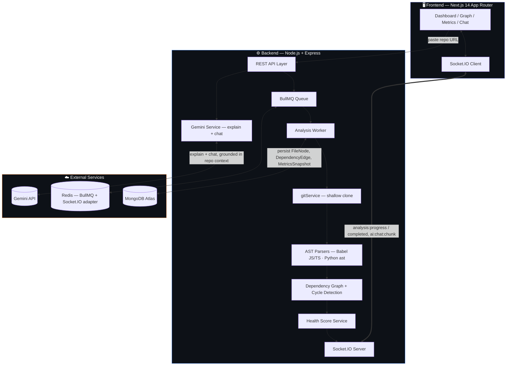
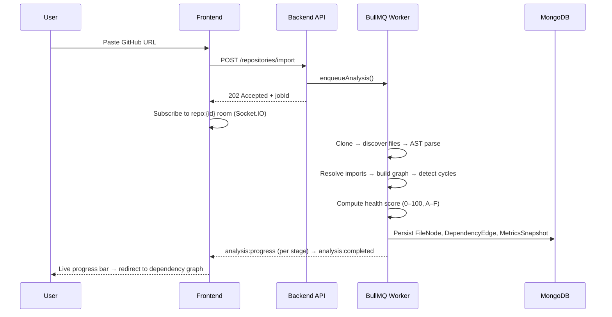
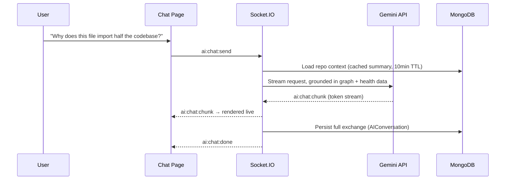

<div align="center">

# 🧠 Archon
### AI-Powered Codebase Intelligence Platform
**Paste a repo URL → get a dependency graph, a health score, and an AI that actually knows your architecture.**


</div>

---

## 🚨 The Problem

Every engineer has opened a repo they didn't write and asked the same three questions:

> *What actually imports what? Where are the circular dependencies hiding? And which files am I terrified to touch?*

`git log` won't tell you. A README won't tell you. You end up either grepping for an hour or making a judgment call on file names alone — right before you break something.

**Archon exists to answer all three questions in under a minute**, by actually parsing the code — not guessing from folder structure — and then letting you ask an AI about what it found.

---

## 💡 What Archon Does

### Core Pipeline: Clone → Parse → Graph → Score → Chat

```
Paste a GitHub URL
        │
        ▼
Shallow clone (size-capped) via simple-git
        │
        ▼
Walk every .js/.jsx/.ts/.tsx/.mjs/.cjs/.py file (node_modules/dist/venv excluded, 3000-file cap)
        │
        ▼
AST parse — @babel/parser+traverse (JS/TS) · Python's ast module via subprocess (.py)
        │
        ▼
Extract imports, exports, functions, per-function McCabe cyclomatic complexity
        │
        ▼
Resolve import specifiers → build the DependencyEdge graph
        │
        ▼
DFS cycle detection (white/gray/black) → circular dependencies flagged
        │
        ▼
Weighted 0–100 health score (complexity 40 / cycles 30 / file size 15 / parse errors 15) → A–F grade
        │
        ▼
🤖 Chat with Gemini — grounded in your repo's actual graph, cycles, and complexity
```

Every stage streams live over Socket.IO, so the frontend shows a real progress bar — cloning → parsing → graph building → cycle detection → scoring — instead of a spinner and a prayer.

---

## 🧩 Features

| Feature | Description |
|---|---|
| 🕸️ **Real AST-Based Dependency Graph** | Not a regex guess — actual Babel/Python AST parsing resolves real import specifiers into a graph |
| 🔁 **Circular Dependency Detection** | DFS with three-color marking finds cycles across disconnected subgraphs, even in large repos |
| 📊 **0–100 Health Score** | Weighted score from complexity, cycles, file size, and parse-error rate, with an A–F letter grade |
| ⚡ **Live Analysis Progress** | Socket.IO streams clone → parse → graph → cycles → score stage-by-stage, with a polling fallback |
| 🗺️ **Interactive Dependency Graph** | React Flow + dagre auto-layout, red pulsing edges on circular dependencies, click-to-inspect any file |
| 🤖 **"Explain with AI"** | Click any file → Gemini explains it using its real imports/importers from the graph, not a summary of the filename |
| 💬 **Repo-Aware Chat** | Ask Gemini about your architecture; answers are grounded in a compact, token-budgeted summary of the actual analysis |
| 🌊 **Streaming Chat** | Socket.IO token-by-token streaming with a non-streaming REST fallback — same persistence path either way |
| 📈 **Complexity & File Breakdown** | Per-file cyclomatic complexity bar chart (Recharts) + a sortable, filterable file table |
| 🔒 **Full Auth** | Email/password + Google OAuth, JWT access + refresh tokens, cookie handling |
| 🐍 **Python Support, Not Just JS** | Python files are parsed with the real `ast` stdlib module, not skipped or best-guessed |

---

## 🏗 System Architecture



### Analysis Pipeline Flow



### Chat Flow (streamed)



---

## 📐 Health Score Formula

Archon doesn't just count lines — it weighs the things that actually predict "this repo is painful to work in":

| Factor | Weight | What it penalizes |
|---|---|---|
| **Cyclomatic complexity** | 40 pts | Functions with too many branches/decision points |
| **Circular dependencies** | 30 pts | Modules that depend on each other in a loop |
| **File size** | 15 pts | Files that have grown into unmanageable god-files |
| **Parse errors** | 15 pts | Structural issues that broke AST parsing |

The result is a single 0–100 score and an A–F grade — something you can watch trend over time as a codebase evolves.

---

## 🛠 Tech Stack

**Backend**
- Node.js + Express, MongoDB (Mongoose)
- Redis + BullMQ — async analysis queue and worker
- Socket.IO — live progress and streamed chat
- Passport (JWT + Google OAuth)
- `@babel/parser` + `@babel/traverse` — JS/TS AST analysis
- Python `ast` module (invoked as a subprocess) — Python AST analysis
- `simple-git` — size-capped shallow cloning
- `@google/generative-ai` (Gemini) — file explanations + repo chat

**Frontend**
- Next.js 14 (App Router) + TypeScript
- Tailwind CSS + shadcn/ui-style primitives (Radix)
- React Flow + dagre — interactive, auto-laid-out dependency graphs
- Recharts — complexity visualizations
- Zustand — client state
- Socket.IO client + `react-markdown` for streamed, formatted chat

**Deployment**
- Backend + worker → Render (or any Node host)
- Frontend → Render / Vercel
- MongoDB Atlas, Redis (Render Key Value or self-hosted)
- `docker-compose.yml` provided for local Mongo + Redis

---

## 🌐 Demo Flow

1. Register (or sign in with Google) → land on the **Dashboard**
2. Paste a repo URL — e.g. `https://github.com/expressjs/express` → **Import**
3. Watch the live progress bar: clone → parse → graph → cycles → score
4. Land on the **Dependency Graph** — pan/zoom, click a node, hit **Explain with AI**
5. Check **Metrics** — health score gauge, complexity chart, sortable file table
6. Open **Chat** and ask it something like *"which file has the most circular dependencies?"*

---

## 💻 Local Setup

```bash
# 0. Infra — Mongo + Redis via Docker (or point MONGO_URI / REDIS_HOST at your own instances)
docker compose up -d

# Terminal 1 — API
cd backend && cp .env.example .env && npm install && npm run dev

# Terminal 2 — analysis worker
cd backend && npm run worker

# Terminal 3 — frontend
cd frontend && cp .env.local.example .env.local && npm install && npm run dev
```

Open **http://localhost:3000**, register, and paste a GitHub URL to see the full pipeline run.

Requires **Docker** (or your own Mongo/Redis) and **`python3` on PATH** (used by the backend for `.py` AST parsing).

To enable AI features (`/ai/explain`, `/ai/chat`), set `GEMINI_API_KEY` in `backend/.env` (get one from [Google AI Studio](https://aistudio.google.com/app/apikey)). Without it, those two endpoints return a 503 — everything else (import, analysis, graph, metrics) works independently of Gemini.

> On free-tier hosts with no separate background worker (e.g. Render's free plan), set `RUN_WORKER_INLINE=true` to run the BullMQ consumer inside the API process instead of a standalone `npm run worker`.

### Required environment variables

| Variable | Purpose |
|---|---|
| `MONGO_URI` | MongoDB connection string |
| `REDIS_URL` / `REDIS_HOST`+`REDIS_PORT`+`REDIS_PASSWORD` | Redis connection for BullMQ + Socket.IO adapter |
| `JWT_SECRET` / `JWT_REFRESH_SECRET` | Access + refresh token signing secrets |
| `GOOGLE_CLIENT_ID` / `GOOGLE_CLIENT_SECRET` | Google OAuth credentials |
| `GEMINI_API_KEY` / `GEMINI_MODEL` | Gemini API key + model for AI explain/chat |
| `CLONE_TMP_DIR` / `MAX_REPO_SIZE_MB` | Where repos are cloned + the size cap |
| `RUN_WORKER_INLINE` | Run the analysis worker inside the API process (free-tier hosting) |

---

## 📂 Repo Layout

```
archon/
  docker-compose.yml    Mongo + Redis for local dev
  backend/
    src/
      config/       env, logger, database, redis, passport, socket
      models/        User, Repository, AnalysisJob, FileNode, DependencyEdge, MetricsSnapshot, AIConversation
      controllers/    authController, repositoryController, aiController
      routes/         authRoutes, repositoryRoutes, aiRoutes, healthRoutes
      services/       gitService, fileDiscoveryService, astParserService,
                       complexityCalculator, pythonParserService,
                       dependencyGraphService, cycleDetectionService,
                       healthScoreService, progressService, analysisService,
                       geminiService, aiContextService, aiChatService
      jobs/          queues.js (enqueueAnalysis), worker.js (BullMQ Worker)
      middleware/    auth, errorHandler, validate, rateLimiter
    scripts/         parse_python_ast.py
  frontend/
    app/
      page.tsx                            landing page
      login/, register/, auth/callback/   auth flow
      dashboard/                          import form + repo grid
      dashboard/[repoId]/graph/           React Flow dependency graph
      dashboard/[repoId]/metrics/         health score + charts + file table
      dashboard/[repoId]/chat/            repo-aware Gemini chat (streaming)
    components/
      ui/          shadcn-style primitives (button, card, dialog, tabs, toast, ...)
      dashboard/   GraphBackdrop, ImportRepoForm, RepoCard, AnalysisProgress
      graph/       FileGraphNode, graphLayout (dagre), DependencyGraph, FileExplainDialog
      metrics/     HealthScoreGauge, ComplexityChart, FileBreakdownTable
      chat/        ChatBubble, ChatComposer, ChatEmptyState
    lib/           api.ts, socket.ts, auth-context.tsx, types.ts, utils.ts
```

---

## 🔌 API Reference

**Repository analysis**

| Method | Route | Purpose |
|---|---|---|
| POST | `/api/repositories/import` | Register a repo URL and enqueue analysis |
| POST | `/api/repositories/:id/analyze` | Re-run analysis on an existing repo |
| GET | `/api/repositories/:id/graph` | Fetch nodes + edges for the dependency graph |
| GET | `/api/repositories/:id/metrics` | Fetch the latest health score + breakdown |
| GET | `/api/repositories/jobs/:jobId` | Poll analysis job status (fallback to sockets) |

**AI**

| Method | Route | Purpose |
|---|---|---|
| POST | `/api/ai/explain` | Explain one file using its graph position + repo context |
| POST | `/api/ai/chat` | Send a chat message (non-streaming) |
| GET | `/api/ai/chat/:repositoryId` | Fetch (or lazily create) the ongoing chat thread |
| DELETE | `/api/ai/chat/:repositoryId` | Clear the chat thread |

Socket.IO (same JWT-authenticated connection):

| Client → Server | Server → Client |
|---|---|
| `subscribe:repo` / `unsubscribe:repo` | `analysis:progress` → `analysis:completed` / `analysis:failed` |
| `ai:chat:send` | `ai:chat:chunk` (streamed tokens) → `ai:chat:done`, or `ai:chat:error` |

All `/ai` routes/events require the repository's latest analysis to be `completed`, and are rate-limited to 40 requests / 15 minutes.

---

<div align="center">

*Every repo has a shape. Archon draws it, scores it, and explains it back to you.*

</div>