<div align="center">

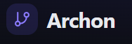

### AI-Powered Codebase Intelligence Platform
**Paste a repo URL → get a dependency graph, a health score, and an AI that actually knows your architecture.**

[](https://archon-github-repo-analyzer-1.onrender.com)

<br/>


</div>

---

## 🚨 The Problem

Every engineer has opened a repo they didn't write and asked the same three questions:

> *What actually imports what? Where are the circular dependencies hiding? And which files am I terrified to touch?*

`git log` won't tell you. A README won't tell you. You end up either grepping for an hour or making a judgment call on file names alone — right before you break something.

**Archon exists to answer all three questions in under a minute**, by actually parsing the code — not guessing from folder structure — and then letting you ask an AI about what it found.

---

## 💡 What Archon Does

<div align="center">

| Step | Stage | What happens |
|:---:|---|---|
| 1️⃣ | 📥 **Import** | Paste a GitHub URL — Archon shallow-clones it in the background (size-capped) |
| 2️⃣ | 🧬 **Parse** | Every `.js/.jsx/.ts/.tsx/.mjs/.cjs/.py` file is parsed like a compiler would — real AST, not regex |
| 3️⃣ | 🕸️ **Graph** | Imports/exports resolve into a dependency graph — core files, leaf files, module clusters |
| 4️⃣ | 🔁 **Detect** | DFS cycle detection flags every circular dependency, even across disconnected subgraphs |
| 5️⃣ | 📊 **Score** | Cyclomatic complexity + cycles + file size + structure roll up into a 0–100 health grade |
| 6️⃣ | 🤖 **Explain & Chat** | Click a file for an AI explanation, or ask Gemini anything — it already knows the graph |

</div>

You never wait on a spinner and hope — every stage above streams live over Socket.IO straight into a real progress bar (*"Parsing file 340/1200…"*) while a BullMQ background worker does the actual work off the request thread.

---

## 🧩 Features

**Core pipeline**

| Feature | Description |
|---|---|
| 🔐 **Full Auth** | Email/password *or* "Continue with Google" — every user's repos, jobs, and chats are tied to their account in MongoDB |
| 📥 **GitHub Import** | Paste a repo URL — Archon clones it in the background and kicks off analysis without blocking your browser |
| 🧬 **Real AST Parsing** | Reads code like a compiler: functions, exports, imports, class extension — the foundation everything else is built on. JS/TS via Babel, **Python via the real stdlib `ast` module**, not skipped or best-guessed |
| 🕸️ **Dependency Graph** | A visual map of every file-to-file connection — core files, leaf files, and whole module clusters, instantly visible |
| 🔁 **Circular Dependency Detection** | Finds every cycle (A→B→A, even through longer chains) and highlights it in red on the graph |
| 📈 **Cyclomatic Complexity Analysis** | Every function scored on how many paths it can take — 1 is simple, 20+ is a mess Archon will point you straight at |
| 📊 **Metrics Dashboard** | Health score (0–100), complexity breakdown, circular dependency count, and a **history chart** that tracks the score across re-analyses |
| 🤖 **AI Architecture Explanations** | Click any file → Gemini explains it in plain English, grounded in its real imports/importers from the graph |
| 💬 **AI Chat Over the Codebase** | Ask *"why does AuthService depend on UserRepository?"* — Gemini has full context of the graph and answers specific to *your* repo |
| ⚡ **Async Analysis, Real-Time Updates** | Large repos run as BullMQ background jobs; the browser gets live WebSocket progress instead of a blocking request |
| 🔄 **Re-Analyze** | Re-run analysis after you've changed the code and watch the health score move |

**Visualization & AI extras**

| Feature | Description |
|---|---|
| 🗺️ **Multiple Graph Layouts** | Switch between **Tree** (hierarchical, best for small repos), **Force** (d3-force, clusters tightly-coupled modules), and **Folders** view — pick the shape that fits the repo |
| 🎯 **Focus / Isolation Mode** | Click a file to dim everything except its direct neighbors; click again (or an empty spot) to clear — built for exploring graphs with hundreds of nodes |
| 🧭 **Architecture (Layer) View** | Files grouped by *responsibility* (Pages, Components, Services, Cross-cutting…) instead of folder, with edges marked **Expected flow**, **Violates layering**, or **Cross-cutting** — click a layer for its files, click an edge for the imports behind it |
| 🔍 **AI Cycle Explanations** | Hover or click a flagged cycle for a dedicated Gemini prompt explaining *why* it likely exists and which import to invert to break it |
| 📄 **AI README Generator** | Generate a full README for the analyzed repo from its real graph + metrics, **Regenerate**, **Copy**, or **Download README.md** — and refine it conversationally ("shorten the tech stack section," "add a badges row") with changes applied in place |
| 📉 **Most-Complex-Files Chart + Sortable Table** | A bar chart of the worst offenders, plus a filterable, sortable file table (LOC, avg/total complexity, flags) |

---

## 🧭 Product Walkthrough

### 1. Landing Page
See a live example of Archon analyzing a real repo before you even sign up.

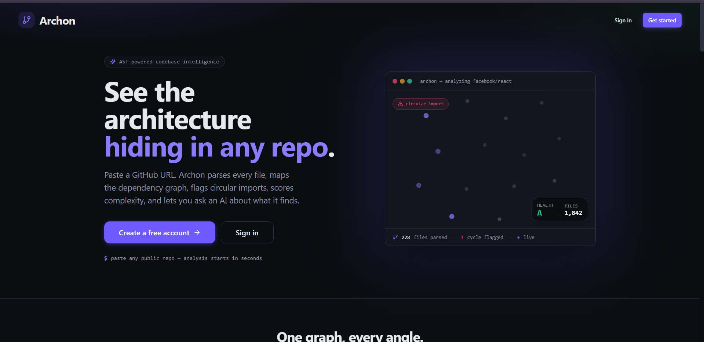

### 2. Sign Up / Sign In
Get started in seconds with email or Google — no long forms.

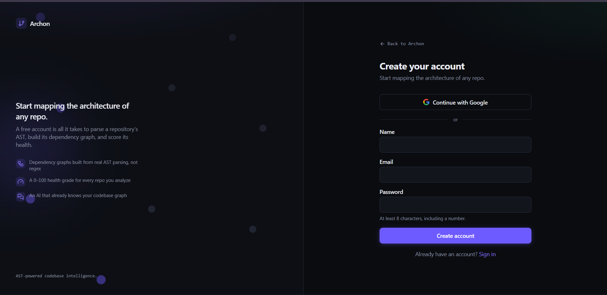

### 3. Dashboard
Drop in a repo link and see all your past analyses in one place.

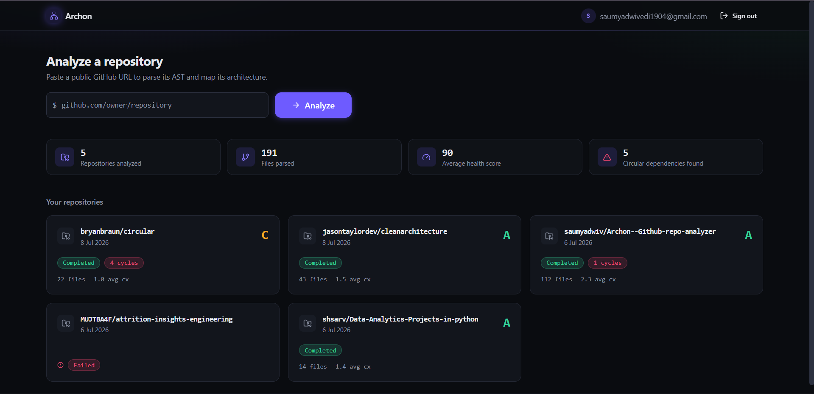

### 4. Dependency Graph
An interactive map of your codebase — explore it visually and spot risky connections at a glance.

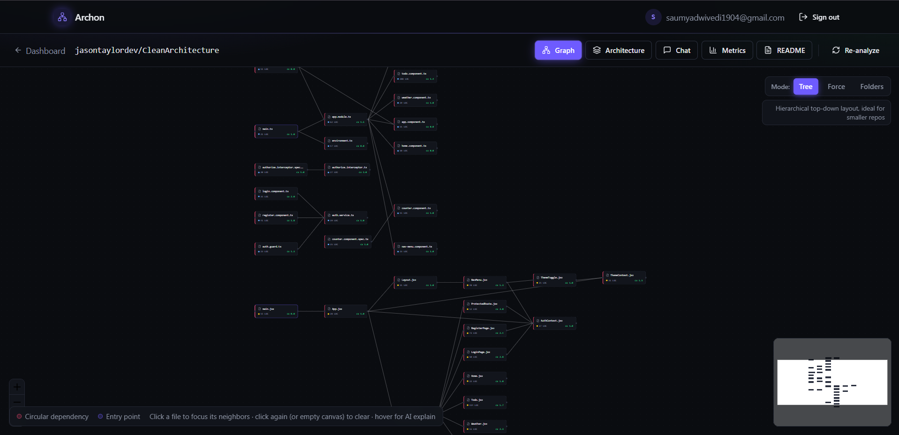

### 5. Architecture View
See how your project is organized by role, not just by folder — great for spotting messy structure.

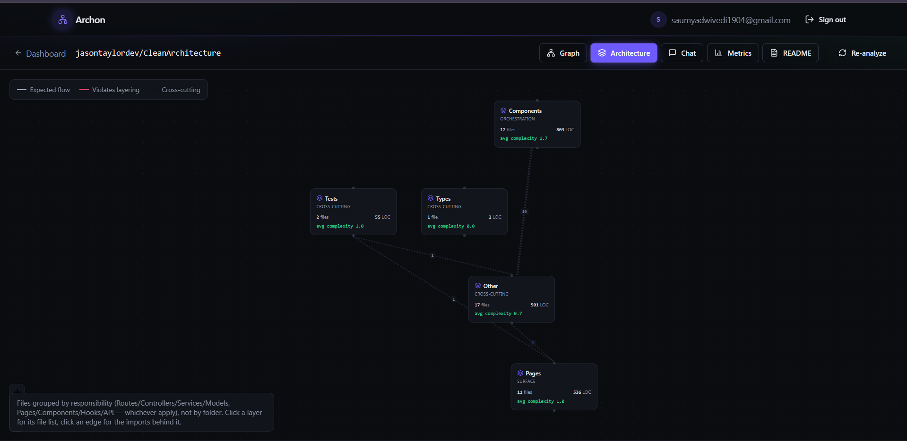

### 6. AI Chat
Ask questions about your codebase in plain English and get answers that actually make sense.

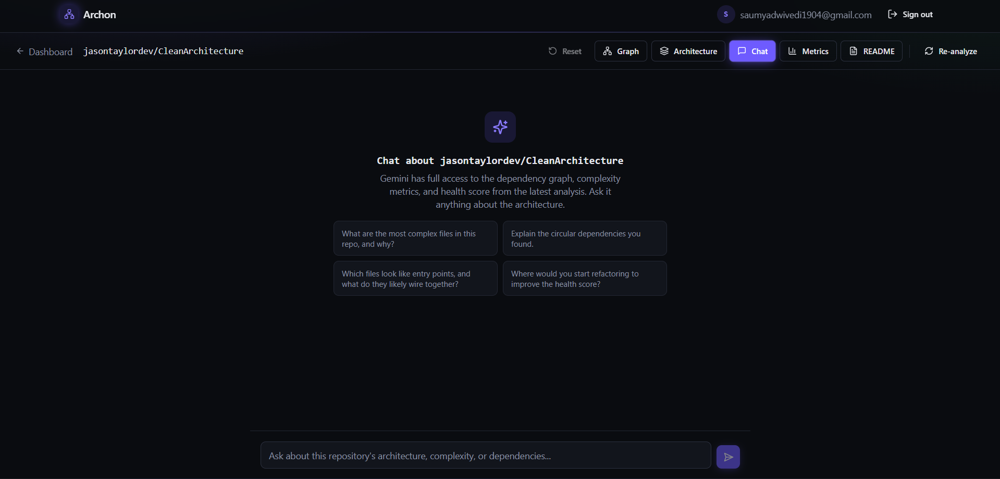

### 7. Metrics
A simple, visual snapshot of your codebase's health — what's working and what needs attention.

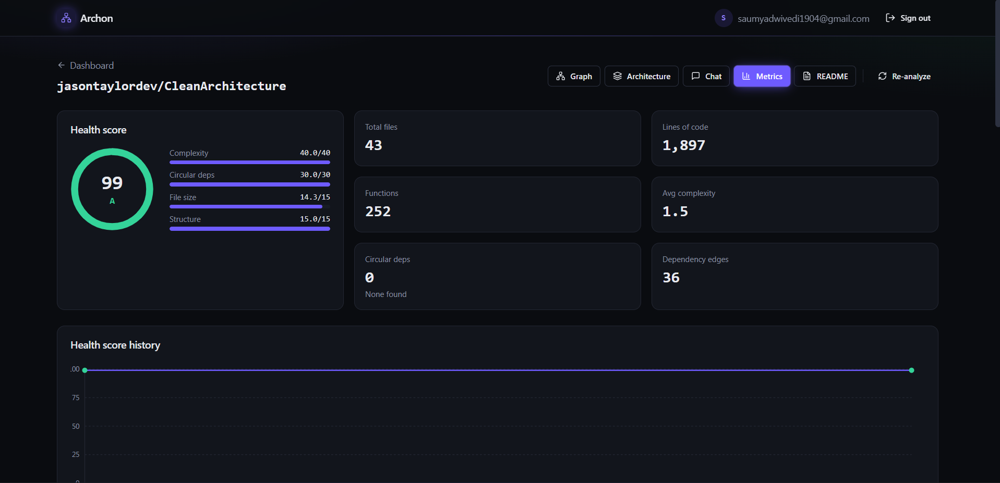

### 8. File Breakdown
Instantly see which parts of your codebase are the most complex.

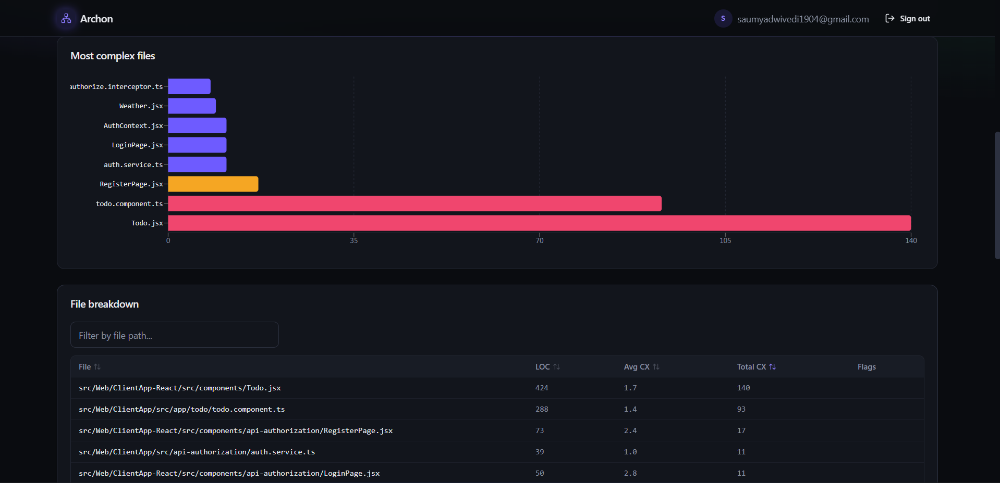

### 9. AI README Generator
Generate a polished README in one click, then just ask the AI to tweak it however you like.

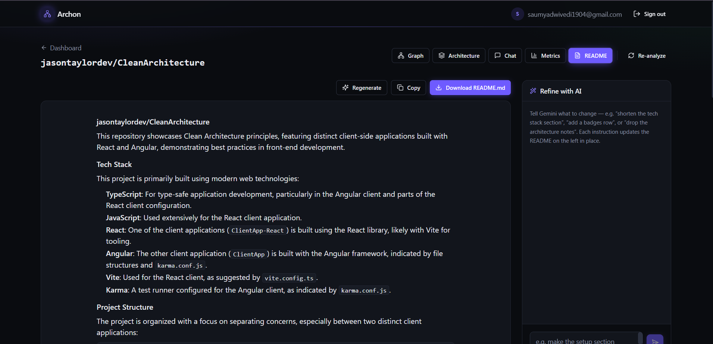

> **Adding your own screenshots:** drop image files into `docs/screenshots/`, then reference them anywhere in this README with ``. That's it — GitHub renders them automatically.

---

## 🏗 System Architecture

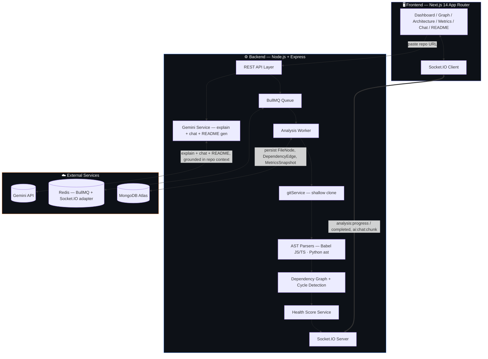

### Analysis Pipeline Flow

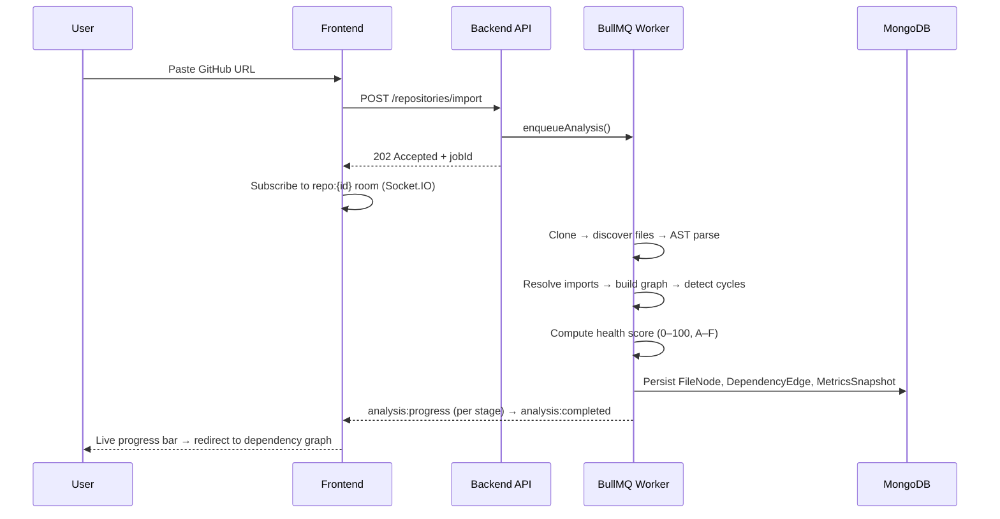

### Chat Flow (streamed)

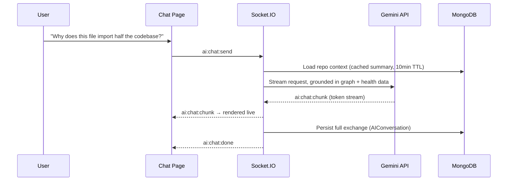

---

## ⚖️ Health Score Formula

Archon doesn't just count lines — it weighs the things that actually predict "this repo is painful to work in":

| Factor | Weight | What it penalizes |
|---|---|---|
| **Cyclomatic complexity** | 40 pts | Functions with too many branches/decision points |
| **Circular dependencies** | 30 pts | Modules that depend on each other in a loop |
| **File size** | 15 pts | Files that have grown into unmanageable god-files |
| **Structure / parse errors** | 15 pts | Structural issues that broke AST parsing |

The result is a single 0–100 score and an A–F grade, tracked over time on a history chart every time you re-analyze.

---

## 🛠 Tech Stack

**Backend**
- Node.js + Express, MongoDB (Mongoose)
- Redis + BullMQ — async analysis queue and worker
- Socket.IO — live progress and streamed chat
- Passport (JWT + Google OAuth)
- `@babel/parser` + `@babel/traverse` — JS/TS AST analysis
- Python `ast` module (invoked as a subprocess) — Python AST analysis
- `simple-git` — size-capped shallow cloning
- `@google/generative-ai` (Gemini) — file explanations, repo chat, README generation

**Frontend**
- Next.js 14 (App Router) + TypeScript
- Tailwind CSS + shadcn/ui-style primitives (Radix)
- React Flow + dagre + d3-force — Tree / Force / Folders graph layouts
- Recharts — complexity charts, health score history
- Zustand — client state
- Socket.IO client + `react-markdown` for streamed, formatted chat and README rendering

---

## 🚀 Deployment

Archon runs fully on **Render** — both the frontend (static/web service) and the backend API are deployed there, with MongoDB Atlas and a Render Redis instance backing them.

| Piece | How |
|---|---|
| **Backend + Frontend** | Both deployed as Render Web Services, deploying straight from `main` |
| **CI** | **GitHub Actions** runs on every push — lint/build checks before Render picks up the deploy |
| **Uptime** | **UptimeRobot** pings the backend on an interval to prevent Render's free-tier services from spinning down on idle, so the live demo doesn't cold-start on you |
| **Worker** | On Render's free tier (no separate background worker service), `RUN_WORKER_INLINE=true` runs the BullMQ consumer inside the API process instead of a standalone process |
| **Database / Queue** | MongoDB Atlas (M0) + Render Redis (Key Value) |

---

## 🌐 Live Demo

🔗 **[archon-github-repo-analyzer-1.onrender.com](https://archon-github-repo-analyzer-1.onrender.com)**

**Try it yourself:**
1. Sign up (email/password or Google) → land on the **Dashboard**
2. Paste any public repo URL — e.g. `https://github.com/jasontaylordev/CleanArchitecture` → **Analyze**
3. Watch the live progress bar walk through clone → parse → graph → cycles → score
4. Explore the **Graph** (switch between Tree / Force / Folders, click a file to focus its neighbors)
5. Check the **Architecture** view to see the repo grouped by responsibility layer instead of folder
6. Open **Metrics** for the health score breakdown, complexity chart, and file table
7. Ask the **Chat** something like *"where would you start refactoring to improve the health score?"*
8. Generate a **README** for the repo, then refine it with a plain-English instruction

> First load on the free tier may take a few seconds if UptimeRobot's last ping was a while ago — subsequent requests are fast.

---

## 💻 Local Setup

```bash
# 0. Infra — Mongo + Redis via Docker (or point MONGO_URI / REDIS_HOST at your own instances)
docker compose up -d

# Terminal 1 — API
cd backend && cp .env.example .env && npm install && npm run dev

# Terminal 2 — analysis worker
cd backend && npm run worker

# Terminal 3 — frontend
cd frontend && cp .env.local.example .env.local && npm install && npm run dev
```

Open **http://localhost:3000**, register, and paste a GitHub URL to see the full pipeline run.

Requires **Docker** (or your own Mongo/Redis) and **`python3` on PATH** (used by the backend for `.py` AST parsing).

To enable AI features (explain, chat, README generation), set `GEMINI_API_KEY` in `backend/.env` (get one from [Google AI Studio](https://aistudio.google.com/app/apikey)). Without it, AI endpoints return a 503 — everything else (import, analysis, graph, metrics) works independently of Gemini.

> On free-tier hosts with no separate background worker (e.g. Render's free plan), set `RUN_WORKER_INLINE=true` to run the BullMQ consumer inside the API process instead of a standalone `npm run worker`.

### Required environment variables

| Variable | Purpose |
|---|---|
| `MONGO_URI` | MongoDB connection string |
| `REDIS_URL` / `REDIS_HOST`+`REDIS_PORT`+`REDIS_PASSWORD` | Redis connection for BullMQ + Socket.IO adapter |
| `JWT_SECRET` / `JWT_REFRESH_SECRET` | Access + refresh token signing secrets |
| `GOOGLE_CLIENT_ID` / `GOOGLE_CLIENT_SECRET` | Google OAuth credentials |
| `GEMINI_API_KEY` / `GEMINI_MODEL` | Gemini API key + model for AI explain/chat/README |
| `CLONE_TMP_DIR` / `MAX_REPO_SIZE_MB` | Where repos are cloned + the size cap |
| `RUN_WORKER_INLINE` | Run the analysis worker inside the API process (free-tier hosting) |

---

## 📂 Repo Layout

```
archon/
├── docker-compose.yml        Mongo + Redis for local dev
├── backend/
│   ├── src/
│   │   ├── config/           env, logger, database, redis, passport, socket
│   │   ├── models/           User, Repository, AnalysisJob, FileNode, DependencyEdge, MetricsSnapshot, AIConversation
│   │   ├── controllers/      authController, repositoryController, aiController
│   │   ├── routes/           authRoutes, repositoryRoutes, aiRoutes, healthRoutes
│   │   ├── services/
│   │   │   ├── gitService.js             shallow clone
│   │   │   ├── fileDiscoveryService.js   walk + filter repo files
│   │   │   ├── astParserService.js       Babel AST (JS/TS)
│   │   │   ├── complexityCalculator.js   McCabe cyclomatic complexity
│   │   │   ├── pythonParserService.js    Python ast subprocess
│   │   │   ├── dependencyGraphService.js resolve imports → graph
│   │   │   ├── cycleDetectionService.js  DFS circular dependency detection
│   │   │   ├── healthScoreService.js     0–100 weighted score + grade
│   │   │   ├── progressService.js        Socket.IO progress emitter
│   │   │   ├── analysisService.js        orchestrates the full pipeline
│   │   │   ├── geminiService.js          explain + chat + README generation
│   │   │   ├── aiContextService.js       token-budgeted repo context builder
│   │   │   └── aiChatService.js          shared REST + socket chat logic
│   │   ├── jobs/
│   │   │   ├── queues.js                 enqueueAnalysis()
│   │   │   └── worker.js                 BullMQ Worker
│   │   └── middleware/       auth, errorHandler, validate, rateLimiter
│   ├── scripts/
│   │   └── parse_python_ast.py
│   └── package.json, .env.example, .gitignore
└── frontend/
    ├── app/
    │   ├── page.tsx                            landing page
    │   ├── login/, register/, auth/callback/   auth flow
    │   ├── dashboard/                          import form + repo grid
    │   └── dashboard/[repoId]/
    │       ├── graph/                          React Flow dependency graph (Tree/Force/Folders)
    │       ├── architecture/                   layer-based responsibility view
    │       ├── metrics/                        health score + charts + file table
    │       ├── chat/                           repo-aware Gemini chat (streaming)
    │       └── readme/                          AI README generator + Refine with AI
    ├── components/
    │   ├── ui/          shadcn-style primitives (button, card, dialog, tabs, toast, ...)
    │   ├── dashboard/   GraphBackdrop, ImportRepoForm, RepoCard, AnalysisProgress
    │   ├── graph/       FileGraphNode, graphLayout (dagre/force), DependencyGraph, FileExplainDialog
    │   ├── architecture/ LayerNode, LayerEdge, ArchitectureGraph
    │   ├── metrics/     HealthScoreGauge, ComplexityChart, FileBreakdownTable
    │   └── chat/        ChatBubble, ChatComposer, ChatEmptyState
    ├── lib/             api.ts, socket.ts, auth-context.tsx, types.ts, utils.ts
    └── package.json, tailwind.config.js, tsconfig.json, .env.local.example
```

---

## 🔌 API Reference

**Repository analysis**

| Method | Route | Purpose |
|---|---|---|
| POST | `/api/repositories/import` | Register a repo URL and enqueue analysis |
| POST | `/api/repositories/:id/analyze` | Re-run analysis on an existing repo |
| GET | `/api/repositories/:id/graph` | Fetch nodes + edges for the dependency graph |
| GET | `/api/repositories/:id/metrics` | Fetch the latest health score + breakdown |
| GET | `/api/repositories/jobs/:jobId` | Poll analysis job status (fallback to sockets) |

**AI**

| Method | Route | Purpose |
|---|---|---|
| POST | `/api/ai/explain` | Explain one file using its graph position + repo context |
| POST | `/api/ai/chat` | Send a chat message (non-streaming) |
| GET | `/api/ai/chat/:repositoryId` | Fetch (or lazily create) the ongoing chat thread |
| DELETE | `/api/ai/chat/:repositoryId` | Clear the chat thread |
| POST | `/api/ai/readme` | Generate a README from the repo's latest analysis |
| POST | `/api/ai/readme/refine` | Apply a plain-English edit instruction to the generated README |

Socket.IO (same JWT-authenticated connection):

| Client → Server | Server → Client |
|---|---|
| `subscribe:repo` / `unsubscribe:repo` | `analysis:progress` → `analysis:completed` / `analysis:failed` |
| `ai:chat:send` | `ai:chat:chunk` (streamed tokens) → `ai:chat:done`, or `ai:chat:error` |

All `/ai` routes/events require the repository's latest analysis to be `completed`, and are rate-limited to 40 requests / 15 minutes.

---

<div align="center">

*Every repo has a shape. Archon draws it, scores it, and explains it back to you.*

</div>
